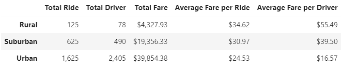
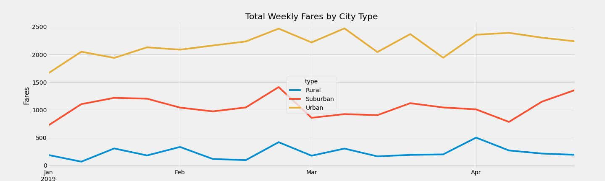

# PyBer_Analysis

## Overview of Project
This analysis summarized data from Pyber rides in multiple cities. The aim was to assess factors that affect Pyber rides. The result was to facilitate further decision-making. 

This project focuses following items:
 - **The data summary** summarized general information by areas.
 - **The total weekly fares by city type** presented the changes in weekly fares by city type

## Analysis

### The data summary
Based on the data summary, the total ride was highest in urban areas with 1625 rides, than lowered in suburban areas with 625 rides, and touched bottom with only 125 rides in rural areas. In correlation with total rides, the number of drivers was only 78 drivers in rural areas, 490 drivers in suburban areas, and 2405 drivers in urban areas. The total fare increases in the same order with $4,327.93 (rural), $19,356.33 (suburban), and $39,854.38 (urban). 
While the nubmer of drivers, total ride, and total fare were increaseing in the order of rural, suburban, and urban areas, the average fare per ride and average fare per driver went the opposite way. In specific, the average fare per ride and driver were highest in rural areas ($34.62 and $55.49), than lowered in subruban ($30.97 and $39.50), and reached the lowest in urban areas ($24.53 and $16.57). 

**Data Summary**

### The total weekly fares by city type
Based on the graph of total weekly fare by city type, 

**The total weekly fare by city type**

## Conclusion
- There was an inversed relationship between average spending per student and results. The higher the spending, the lower the result and vice versa. However, since the data only included a specific spending range from $550 to $675, the pattern might change in the ranges of higher than $675 and of lower than $550. 

- The sizes schools influenced their students's performance. In specific, schools that had 2000 students or less performed better than schools that had from 2000 to 5000 students. One of the possible reasons could be the insufficiency of staff and facilities. More data with higher level of details are needed to better assess the relationship of school sizes and students' performance such as total fixed assets or number of staff and educators in each school. 

- The influences of school types should be taken into account. Based on provided data, district-typed schools performed less effective than charter-typed schools. A more in-depth analysis should be conducted to figure out potential reasons as well as solutions. 

- Finally, to increase the reliability of this dataset, there should be an additional analysis to assess the influences of potential outliers which could mislead the above results. 
